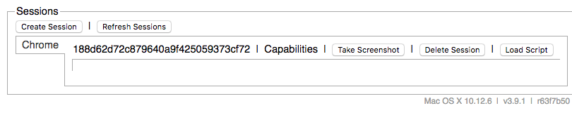
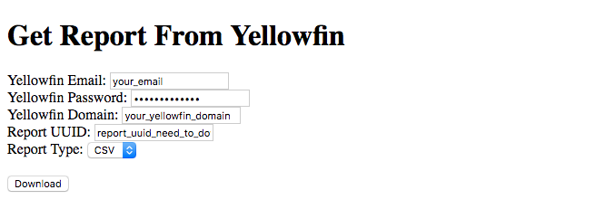
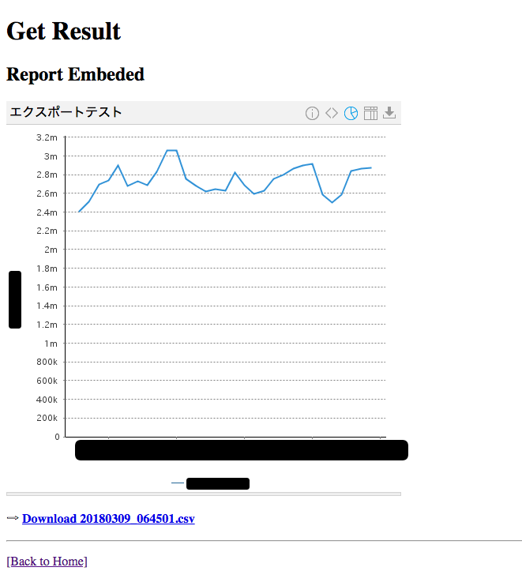

# Yellowfin Report API

This project using Slim/PHP and Selenium WebDriver to get generated report via UUID, save to local and process it.

## Requirements

- Install PHP 7.x, Composer
- Install Google Chrome
- Install Java 8

## Setup machine

- Copy the `.env.example` file to a local `.env` and ensure all the settings are correct for their local environment. Example:
```
YELLOWFIN_EMAIL=email@example.com
YELLOWFIN_PASSWORD=p@ssword
YELLOWFIN_DOMAIN=http://report.example.com
YELLOWFIN_REPORT_ID=097f658d-6b9e-4gdf-98q0-q28n003m5784
```

- Change to project directory and install packages
```
$ cd /path/to/project
$ composer install
```

## Start selenium server

- Command:
```
$ java -Dwebdriver.chrome.driver=chromedriver-2.36-mac64 -jar selenium-server-standalone-3.9.1.jar
```

If you running on Linux(Ubuntu/Centos) please using `chromedriver-2.36-linux64` driver.

- WebDriver Hub: http://localhost:4444/wd/hub/static/resource/hub.html


## Start web server

- Command:
```php
$ php -t public -S 0.0.0.0:8000 router.php
```

- Web: http://localhost:8000
  - Home page

  
  - Get result page

  
